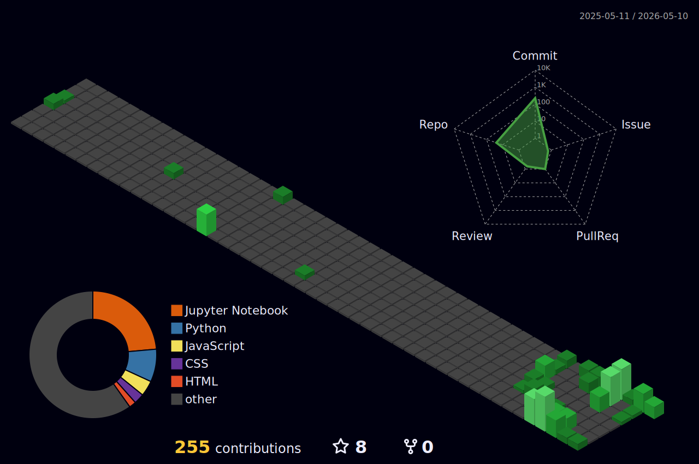

<!-- header 

  

 -->

<!--

 -->

<!-- 

  

-->

<!-- bio -->

**Hi, I am Tcherno**

> Computer Engineer passionate about Artificial Intelligence, mathematics and cloud technologies, with hands-on experience building intelligent and scalable data-driven systems.
> 
> Interested in RAG systems, AI research, and modern data architectures, and currently seeking opportunities in AI Engineering, Machine Learning, Data Engineering, and research-oriented AI environments.

<!-- skills -->
**Skills**

<table>
  <tr>
    <td valign="top" width="160px">Artificial Intelligence</td>
    <td>
      
      
      
      
      
      
      
    </td>
  </tr>
  <tr>
    <td valign="top">Languages</td>
    <td>
      
      
      
      
    </td>
  </tr>
  <tr>
    <td valign="top">ML Frameworks</td>
    <td>
      
      
      
      
      
      
    </td>
  </tr>
  <tr>
    <td valign="top">Cloud & DevOps</td>
    <td>
      
      
      
      
      
      
      
    </td>
  </tr>
  <tr>
    <td valign="top">Big Data</td>
    <td>
      
      
      
      
      
      
      
      
      
    </td>
  </tr>
  <tr>
    <td valign="top">Databases</td>
    <td>
      
      
      
      
      
      
    </td>
  </tr>
</table>

<!-- stats -->
**Stats**

  
  

<!-- snake 

  

  
  

  

-->

<!-- 3D profile 
**Contributions**

-->

<!-- Views 
**Profile views**

  

 -->